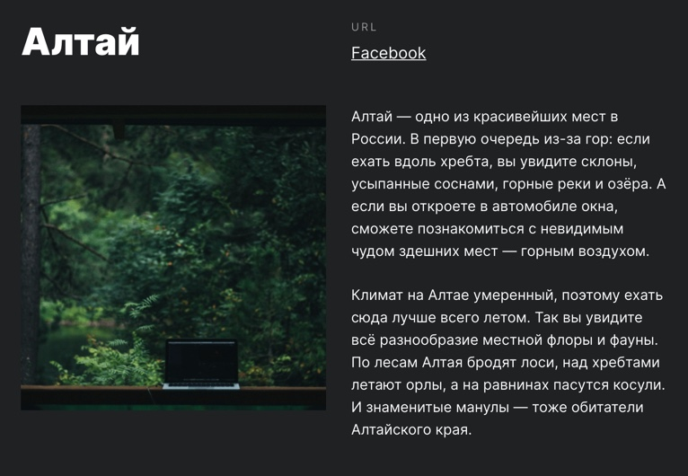

# Путешествие по России 
Учебный проект по профессии Веб-разработчик от **[Яндекс Практикум](https://praktikum.yandex.ru/web)**
Опубликованный проект можно посмотреть **[по ссылке](https://yuliaiv-iv.github.io/russian-travel)**

### Содержание
* Описание
* Технологии
* Figma

### Описание

Лендинг - типовой одностраничный сайт **«Путешествия по России»**. Данный проект предоставляет информацию о путешествиях и уникальных местах страны. Страница адаптивная для просмотра на устройствах с различным разрешением.

### Технологии

При разработке веб-сайта использованы следующие технологии:
1.	Создана Nested файловая структура CSS по методологии БЭМ	
2.	Применен hover для изменения состояния ссылок
3.	Используется flexbox и grid-layout
4.	Используются медиазапросы по 4 интервалам для отображения сайта на устройствах с разным расширением
* от 1280 px
* от 1024 и до 1280
* от 768 и до 1024
* от 320 до 768

### Figma

Применен  шрифт ”Inter“, который можно бесплатно скачать по **[этой ссылке](https://rsms.me/inter)**
Макет Figma можно посмотреть по **[ссылке](https://www.figma.com/file/OyRWEjU6wBwRe1hapzQoLx/Sprint-3%3A-Russia-%2F-desktop-%2B-mobile)**

first
    

second
    

